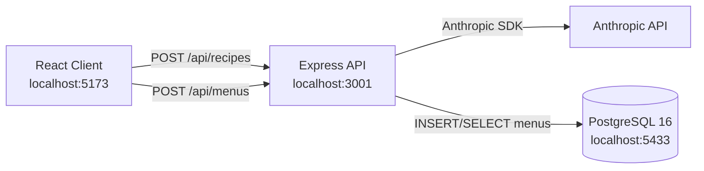

# Dinner Party Planner

Dinner Party Planner is a full-stack app that generates themed party menus with AI and lets you save menus to PostgreSQL.

## Architecture Description

The project has three running parts:

- Client: React + Vite UI in `client/`
- API Server: Express service in `server/`
- Database: PostgreSQL 16 in Docker from `docker-compose.yml`

Data flow:

1. User submits planner input in the React client.
2. Client sends `POST /api/recipes` to the Express server.
3. Server calls Anthropic and returns structured recipes.
4. User optionally saves generated recipes with `POST /api/menus`.
5. Server writes menu data to PostgreSQL and returns the saved record id.



## Function Description

### Frontend functions

- Planner form: Collects guest count, meal type, theme, and ingredient avoidances.
- Menu generation: Calls `POST /api/recipes` and renders grouped recipe cards.
- Recipe controls: Lets users expand recipe details and select recipes for output.
- Printing tools: Prints selected menu and selected recipes with a custom header/logo flow.
- Menu persistence: Saves generated menu to the backend with `POST /api/menus`.

### Backend functions

- `POST /api/recipes`: Validates request, requests 7-10 recipes from Anthropic, and returns normalized recipe objects.
- `POST /api/menus`: Saves generated recipes and planner metadata into PostgreSQL.
- `GET /api/menus`: Returns up to 50 recently saved menus.
- Database initialization: Creates the `menus` table automatically at server startup if it does not exist.

## Prerequisites

- Node.js 18+
- npm
- Docker Desktop (or Docker Engine with Compose)
- Anthropic API key

## Environment Variables

Create `server/.env`:

```env
ANTHROPIC_API_KEY=your_api_key_here
```

Optional overrides (defaults already match `docker-compose.yml`):

```env
PORT=3001
PGHOST=localhost
PGPORT=5433
PGUSER=dinner_user
PGPASSWORD=dinner_password
PGDATABASE=dinner_party_planner
```

## Current Startup Instructions (npm + docker-compose)

Run from the project root unless a step says otherwise.

1. Install client dependencies:

```bash
cd client
npm install
```

2. Install server dependencies:

```bash
cd ../server
npm install
```

3. Start PostgreSQL with Compose:

```bash
cd ..
docker compose up -d
```

If your environment uses the legacy command name, use:

```bash
docker-compose up -d
```

4. Start the API server:

```bash
cd server
npm run dev
```

5. Start the client in a second terminal:

```bash
cd client
npm run dev
```

6. Open the app:

- Client: http://localhost:5173
- API: http://localhost:3001

## Helpful Commands

- Stop PostgreSQL container:

```bash
docker compose down
```

- View database container status:

```bash
docker compose ps
```

- Build frontend production assets:

```bash
cd client
npm run build
```

## Troubleshooting

- If menu generation fails, verify `ANTHROPIC_API_KEY` in `server/.env`.
- If the client cannot reach the API, confirm the server is running on port 3001.
- If saving menus fails, confirm PostgreSQL is up and healthy via Compose.
- There is no root `package.json`; run npm commands from `client/` or `server/`.